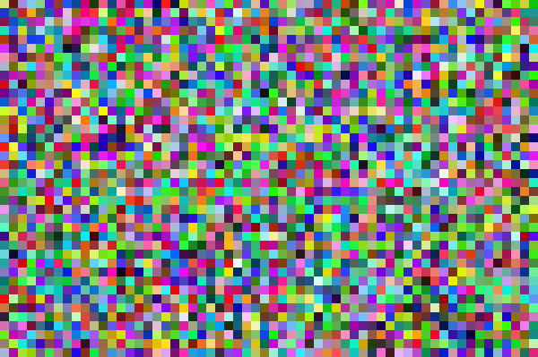

# Simple RGB noise

A sketch used for creating a simple (but nifty nevertheless) 2D noise generator. The code is written using Processing. Change window resolution with ´size()´ and size of squares with ´res´.

